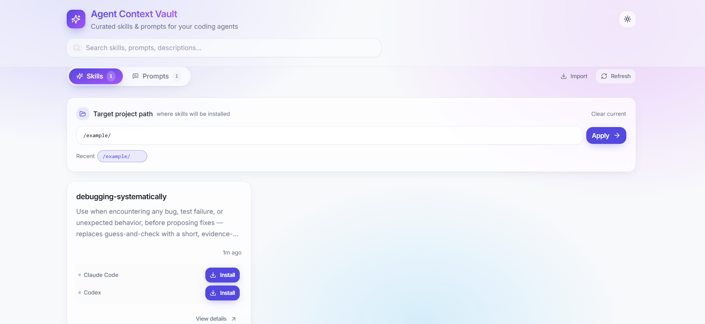

# Agent Context Vault

A local app for managing reusable, hot-pluggable **skills** and **prompts** for Claude Code and Codex — built around reuse, organization, and easy customization.



## Why

Working with Claude Code (or Codex) across multiple projects usually means copy-pasting the same skill folders around, losing track of which project has which version, and slowly drifting away from a single source of truth. Agent Context Vault keeps one curated library on your machine and lets you drop pieces into any project as needed.

- **Reuse** — write or import a skill/prompt once, install it into any project.
- **Manage** — see your whole library in one UI; know what's installed where.
- **Customize** — edit content in-app or directly on disk; everything is plain Markdown under Git.

## Core concepts

- **Skill** — a directory containing `SKILL.md` (with frontmatter) plus any supporting files.
- **Prompt** — a single Markdown file with frontmatter and body.
- **Hot-pluggable** — the canonical copy lives in `vault/`. Installing copies it into a project's `.claude/skills/<slug>` or `.codex/skills/<slug>`. Uninstalling removes the copy. The source is never touched.

## Quick start

```bash
pnpm install
pnpm dev              # starts the local server (:5179) and the web UI (:5173)
```

Open the UI, then set a **Target Path** (the project you want to install skills into). That's it.

## Features

- Browse and search your library of skills and prompts, with a detail drawer for each.
- One-click install / uninstall into a project's `.claude/` or `.codex/` directory.
- Edit prompts in-app via a structured frontmatter + body editor; edit skills directly on disk.
- Create new prompts from the UI.
- Import skills from any GitHub `tree/` URL — the contents land in `vault/skills/<slug>`.
- Rename skills with directory + frontmatter kept in sync.
- Local modifications to installed copies are detected, so you don't accidentally clobber your own edits.

## Repository layout

```
vault/
  skills/<slug>/SKILL.md       # skill source (directory + frontmatter)
  prompts/<slug>.md            # prompt source (single file + frontmatter)
server/                        # local Node API (no DB, reads vault/ directly)
src/                           # Vite + React UI
~/.agent-vault/config.json     # remembered target path and recents
```

## Design

Three ideas hold the project together:

1. **Plain Markdown is the only persistent state.** No database. Skills are directories, prompts are files, frontmatter is the metadata. Git is the history layer — you can bypass the UI at any time and edit, diff, or revert with normal tools.
2. **Local-first, zero cloud.** Everything runs on `localhost`. The only outbound traffic is when you explicitly import from GitHub.
3. **Source and installed copy are kept distinct.** The vault is the source of truth; project directories hold copies. The app compares them so you can tell when an installed copy has been modified, and refuses destructive operations on dirty copies unless forced.

## License

[MIT](./LICENSE)
